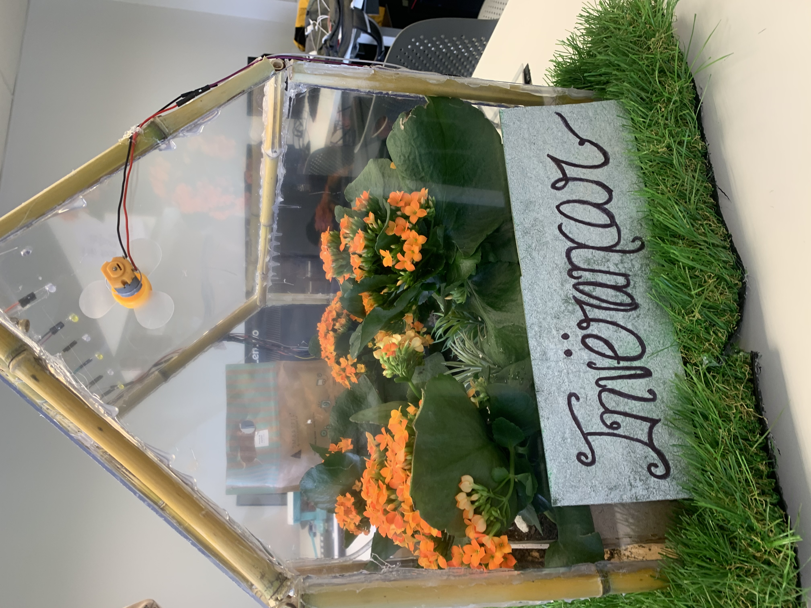
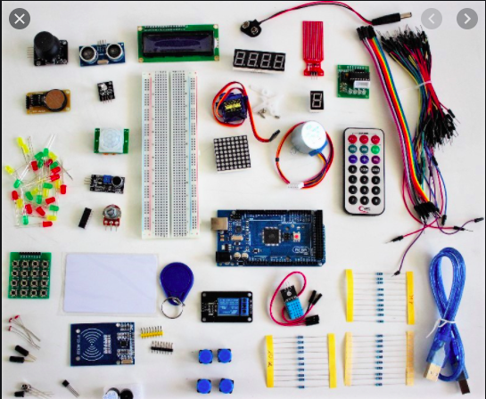
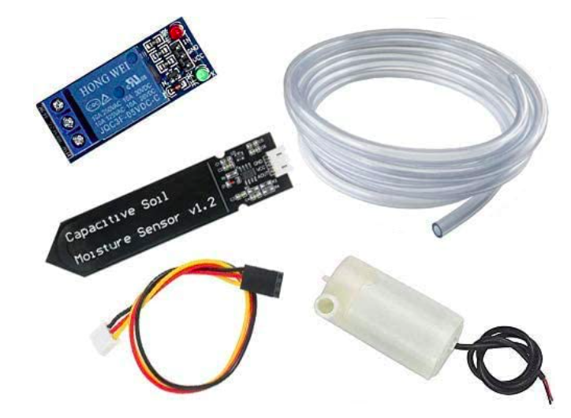
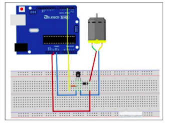
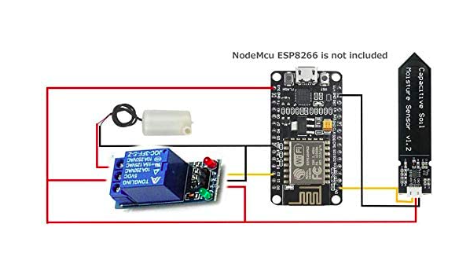
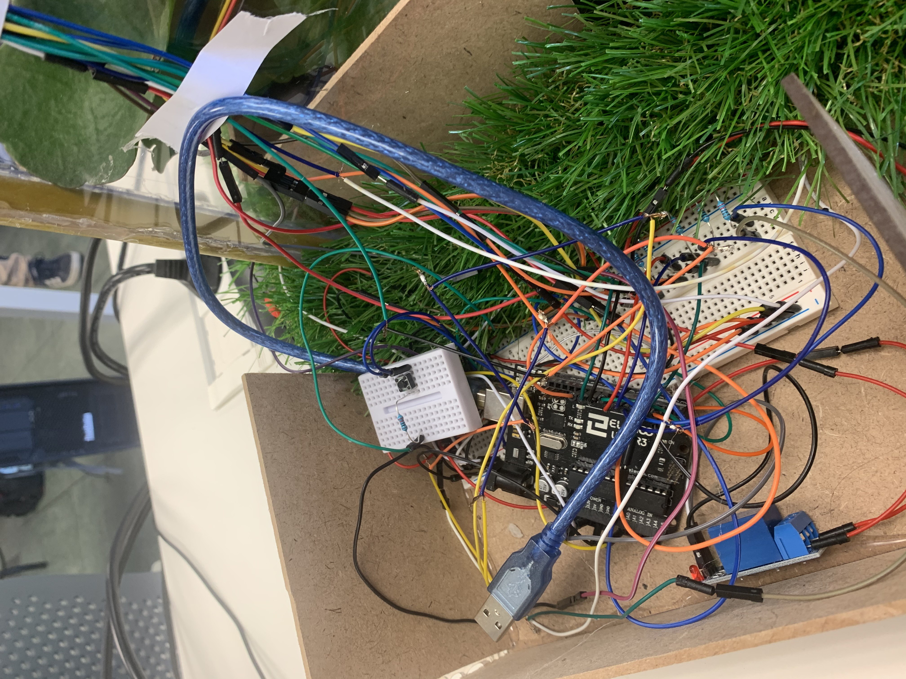
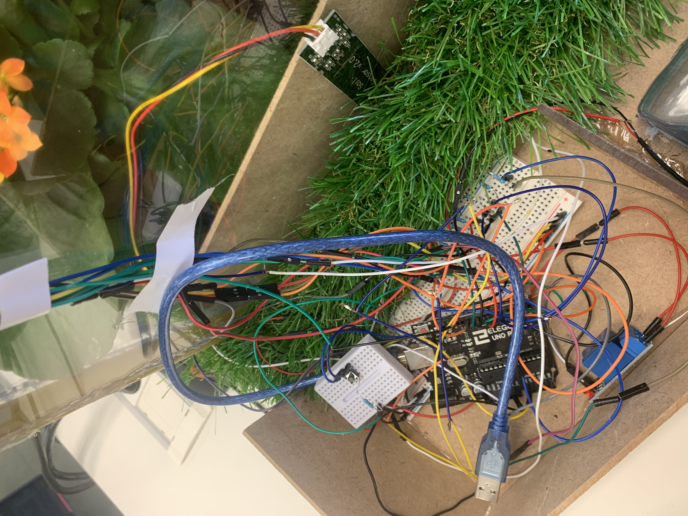
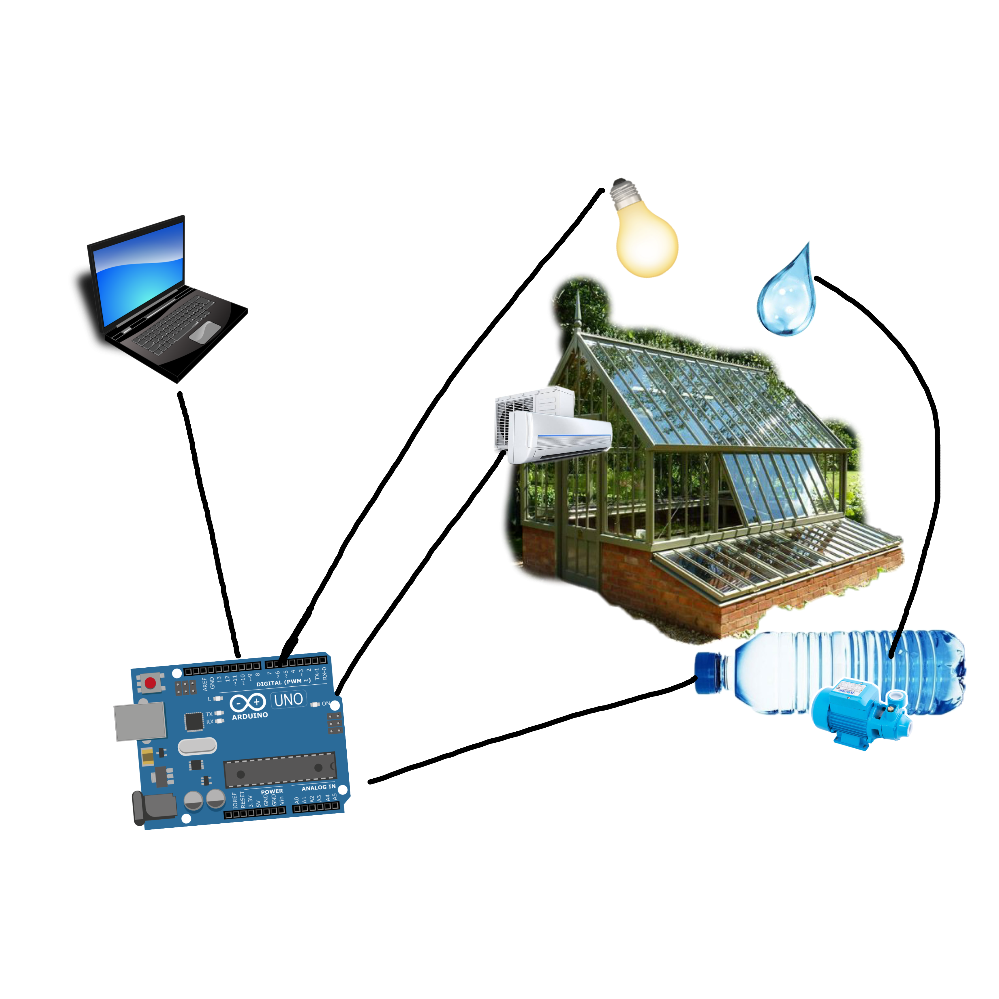

# Inverancar

## Introducción
Inverancar es nunestro proyecto realizado con componentes arduino. Se trata de un invernadero con ventilación, sensor de humedad, sistema de riego e iluminación.

## Componentes
#### 1.Arduino
#### 2.Motor pequeño de 6V DC
#### 3. 270 Ω Resistencia
#### 4.Transistor PN2222
#### 5.Cables
#### 6.LED (blanco, amarillo)
#### 7.Relé
#### 8.Bomba de agua
#### 9.Sensor humedad
#### 10.Boton
#### 11.Ventilador
#### 12.Protoboard

## Explicación
El sistema de riego funciona de la siguiente manera: el sensor de humedad detecta la humedad que tiene la tierra en caso de que esté baja se actva el sistema de riego.

Sistema de ventilación e ilumninación: cuando se pulsa el botón se activan ambos sistemas el motor se activa junto con los led y cuando dejas de pulsar se desactiva.

## Conexiones por partes
### Los LED
Lo primero que haremos será enganchar las LED a la Placa Protoboard de tal forma
que la parte positiva de los LED, la parte más larga, esté colocada a la izquierda,
para que más adelante nos resulte más fácil poner los conectores y las
resistencias. Una vez hemos enganchado cada LED lo que haremos será conectar
las 6 resistencias; Enganchamos una de las patas de la resistencia a la misma fila
de un LED donde se encuentra su pata positiva y el otro extremo a otro sitio para
que después en esa misma fila enganchemos un conector que por su otra parte
estará colocado en su pin correspondiente del Arduino. Y por último lo que
haremos será conectar todas las patas del LED (Las negativas), gracias a los
conectores MM y los engancharemos todos en una misma fila en la cual, de esa
misma fila va a salir un conector, que no está enganchado a ninguna LED, el cual va
a conectarse con el pin GND del Arduino, por último conectar el cable USB tipo AB.
### El Ventilador
Lo primero que haremos será crear el siguiente circuito poniendo y enganchando
los componentes en su lugar correspondiente.

Y a continuación para añadirle el potenciómetro al tener tres patas enganchamos
una de ellas a la corriente “tierra” otra de ellas a la parte positiva y la última que
es la que está sola es la parte de enganchar lo que queremos que funcione por lo
que enganchamos otra parte positiva y así gracias al montaje anterior y a añadir el
potenciómetro conseguimos nuestro segundo proyecto.
### Sistema de riego
Creamosrear el siguiente circuito poniendo y enganchando
los componentes en su lugar correspondiente.

### Resultado conexiones

### Montaje Estructura
Lo primero que necesitamos es el material que podemos ver más arriba, en nuestro caso para hacer la estructura hemos utilizado bambú (para crar la estructura, es decir, los cimientos de nuestro invernadero), con la madera haremos la base de nuestro invernadero creacando una cajita para más adelante meter nuestras plantas y por último el polietireno el cual va hacer de paredes.
### Partes
Lo primero que haremos será crear la base de nuestra estructura, a continuacion haremos los cimientos de nuestro invernadero con bambú y por último de estructura pondremos las paredes.Una vez tenemos la estructura del proyecto procederemos al cableado y por ultimo al código

## Esquema del escenario de red

## Referencias
Bomba de agua y relé: https://www.amazon.es/RUNCCI-YUN-Sistema-Autom%C3%A1tico-Arduino-Humedad/dp/B0814HXWVV/ref=asc_df_B0814HXWVV/?tag=googshopes-21&linkCode=df0&hvadid=420354457167&hvpos=&hvnetw=g&hvrand=10323851708403857687&hvpone=&hvptwo=&hvqmt=&hvdev=c&hvdvcmdl=&hvlocint=&hvlocphy=1005493&hvtargid=pla-845333898910&psc=1&tag=&ref=&adgrpid=97670014738&hvpone=&hvptwo=&hvadid=420354457167&hvpos=&hvnetw=g&hvrand=10323851708403857687&hvqmt=&hvdev=c&hvdvcmdl=&hvlocint=&hvlocphy=1005493&hvtargid=pla-845333898910

Motor: https://descubrearduino.com/dc-motor/

