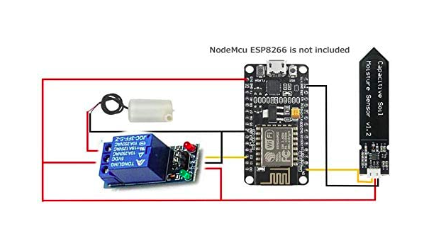

# Inberancar
## Introducción
Inberancar es nunestro proyecto realizado con componentes arduino. Se trata de un invernadero con ventilación, sensor de humedad, sistema de riego e iluminación.

## Componentes
#### 1.Arduino
#### 2.Motor pequeño de 6V DC
#### 3. 270 Ω Resistencia
#### 4.Transistor PN2222
#### 5.Cables
#### 6.LED (blanco, amarillo)
#### 7.Relé
#### 8.Bomba de agua
#### 9.Sensor humedad
#### 10.Boton
#### 11.Ventilador
#### 12.Protoboard

## Explicación
El sistema de riego funciona de la siguiente manera: el sensor de humedad detecta la humedad que tiene la tierra en caso de que esté baja se actva el sistema de riego.

Sistema de ventilación e ilumninación: cuando se pulsa el botón se activan ambos sistemas el motor se activa junto con los led y cuando dejas de pulsar se desactiva.
